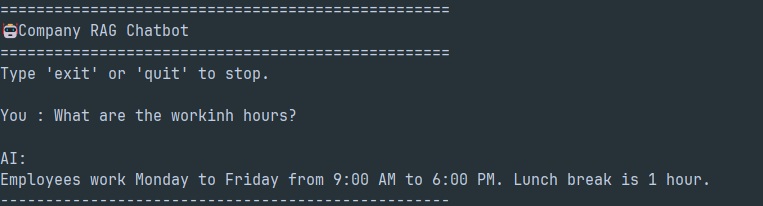
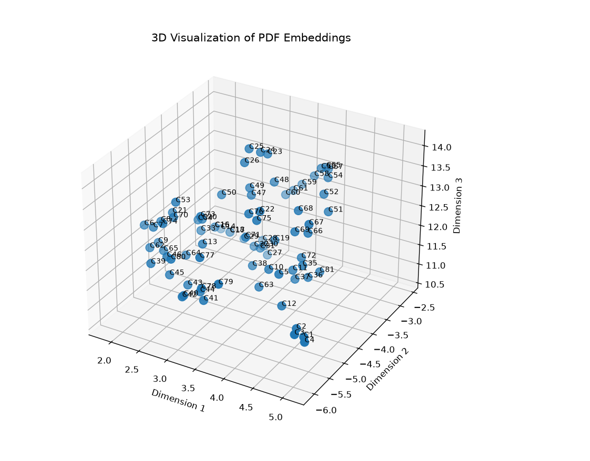

# RAG_POC

A simple Retrieval-Augmented Generation (RAG) chatbot built using Python, Sentence Transformers, Supabase (pgvector), and Google Gemini.

The chatbot retrieves relevant information from PDF documents using semantic search and generates context-aware answers using Gemini.

---

## Features

- PDF text extraction
- Text chunking
- Embedding generation using Sentence Transformers
- Vector storage with Supabase (pgvector)
- Semantic similarity search
- Google Gemini-powered answer generation
- Prevents hallucinations by answering only from retrieved context
- Interactive 3D embedding visualization using UMAP for semantic cluster analysis

---

## Tech Stack

- Python
- Sentence Transformers
- Supabase
- pgvector
- Google Gemini
- PyPDF
- NumPy
- UMAP
- Matplotlib

---

## Project Structure

```text
RAG_POC/
│
├── data/
│   └── company.pdf
│
├── database/
│   ├── 01_enable_pgvector.sql
│   ├── 02_create_documents_table.sql
│   └── 03_similarity_search.sql
│
├── images/
│   ├── chatbot_response.png
│   └── embedding_visualization.png
│
├── pdf_loader.py
├── chunker.py
├── embedding.py
├── supabase_db.py
├── retriever.py
├── gemini.py
├── visualize_embeddings.py      # 3D visualization using UMAP
├── index_documents.py
├── chat.py
│
├── requirements.txt
├── .gitignore
├── README.md
└── .env
```

---

## Workflow

```text
                    PDF
                     │
                     ▼
                Load PDF
                     │
                     ▼
               Chunk Text
                     │
                     ▼
          Generate Embeddings
                     │
          ┌──────────┴──────────┐
          │                     │
          ▼                     ▼
3D Embedding Visualization   Store Embeddings
        (UMAP)               in Supabase
                                    │
                                    ▼
                              User Query
                                    │
                                    ▼
                     Generate Query Embedding
                                    │
                                    ▼
                    Semantic Similarity Search
                                    │
                                    ▼
                          Retrieved Context
                                    │
                                    ▼
                             Google Gemini
                                    │
                                    ▼
                              Final Answer
```

---

## Installation

Clone the repository:

```bash
git clone <repository-url>
```

Move into the project directory:

```bash
cd RAG_POC
```

Install the dependencies:

```bash
pip install -r requirements.txt
```

Create a `.env` file:

```env
SUPABASE_URL=YOUR_SUPABASE_URL
SUPABASE_KEY=YOUR_SUPABASE_KEY
GEMINI_API_KEY=YOUR_GEMINI_API_KEY
```

---

## Run

### Index the PDF

```bash
python index_documents.py
```

### Start the chatbot

```bash
python chat.py
```

### Visualize document embeddings (Optional)

```bash
python visualize_embeddings.py
```

This generates a 3D UMAP visualization of the document embeddings, helping analyze how semantically similar document chunks are grouped together in vector space.

---

## Example

### Question

```
What are the working hours?
```

### Answer

```
Employees work Monday to Friday from 9:00 AM to 6:00 PM.

Lunch break is 1 hour.
```

---

## Screenshots

### Chatbot Response

<p align="center">
  
</p>

### 3D Embedding Visualization

<p align="center">
  
</p>

---

## Future Improvements

- Multiple PDF support
- FastAPI backend
- React frontend
- Chat history
- Metadata filtering
- Hybrid search
- Docker deployment

---

## Author

**Harshit Singh**